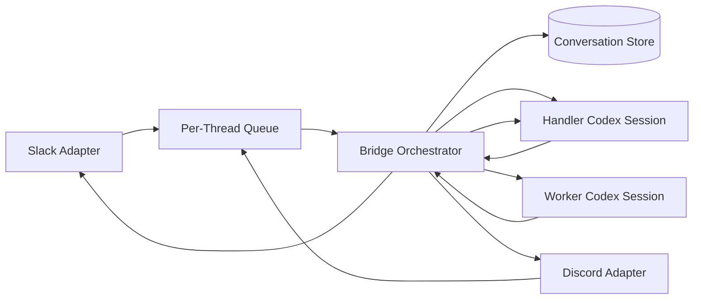

# IM to Codex Bridge Design

## Goal

Allow Slack and Discord users to talk to Codex conversationally, while still supporting real repo-scoped coding work.

The key design choice is:

- the IM thread itself maps to a persistent handler Codex session
- repo-scoped coding work runs in a separate worker Codex session
- the handler decides when to ask clarifying questions, when to bind a repo, and when to delegate to the worker

This gives you a more natural chat UX than a command-only bridge. The user can say things like:

- "work on nuntius in this thread"
- "check why CI is failing"
- "actually switch to api-server"
- "summarize what you changed"

The handler Codex interprets intent and only forwards repo work to the worker session when needed.

## Codex Surfaces

This design uses the locally available Codex CLI:

- `codex exec --json`
- `codex exec resume --json`

That is enough for both persistent handler sessions and persistent worker sessions.

## Core Model

Each IM conversation thread keeps two layers of state:

### 1. Handler Session

This is the conversational front-end.

Responsibilities:

- talk naturally with the user
- understand intent
- ask which repo to use when needed
- decide whether the message is just conversational or needs repo work
- decide when to bind, rebind, or reset
- summarize worker results back to the user

### 2. Worker Session

This is the repo-scoped execution session.

Responsibilities:

- inspect code
- edit files
- run tests
- perform reviews
- answer repo-specific technical questions

The worker is bound to one configured repository target at a time.

## Thread Semantics

One chat thread maps to:

- one handler Codex session
- zero or one active repository binding
- zero or one active worker Codex session for that binding

That means:

- the thread can be conversational even before a repo is chosen
- once a repo is bound, later repo tasks in that thread reuse the same worker session
- switching repos is explicit and clears the old worker session

## Architecture



## Conversation Flow

### User Turn

1. The adapter normalizes the IM message into an `InboundTurn`.
2. The bridge resumes or creates the handler Codex session for that thread.
3. The handler returns a structured decision in JSON.

Possible handler decisions:

- `reply`
- `bind_repo`
- `delegate`
- `reset`

### Direct Reply

If the handler returns `reply`, the bridge posts that message to Slack or Discord.

Use this for:

- clarification questions
- general conversation
- status answers
- repo selection prompts

### Bind Repo

If the handler returns `bind_repo`, the bridge:

1. validates the repo ID against configured targets
2. updates the thread binding
3. clears the old worker session if the repo changed
4. optionally runs a worker task immediately if the handler included `continueWithWorkerPrompt`

### Delegate to Worker

If the handler returns `delegate`, the bridge:

1. resumes or creates the worker Codex session for the bound repo
2. runs the repo-scoped task
3. sends the worker result back into the handler session
4. resumes the handler and asks it to compose the final user-facing reply

This is the critical pattern: the user does not talk to the worker directly. The handler remains the conversational owner of the thread.

## State Model

The persisted thread state should look like this:

```ts
type ConversationBinding = {
  key: ConversationKey;
  handlerSessionId?: string;
  activeRepository?: {
    repositoryId: string;
    repositoryPath: string;
    sandboxMode: "read-only" | "workspace-write" | "danger-full-access";
    model?: string;
    workerSessionId?: string;
    updatedAt: string;
  };
  createdByUserId: string;
  createdAt: string;
  updatedAt: string;
};
```

Important rules:

- `handlerSessionId` survives ordinary repo resets unless the user explicitly resets the whole thread
- `workerSessionId` is valid only for the active repository binding
- changing repositories clears the old `workerSessionId`

## Handler Protocol

Because the Codex CLI session is not exposing arbitrary custom tools here, the bridge uses a strict JSON protocol between the handler and the orchestrator.

Expected handler output:

```json
{"action":"reply","message":"Which repo should I use for this thread?"}
```

```json
{"action":"bind_repo","repositoryId":"nuntius","message":"Bound this thread to nuntius."}
```

```json
{"action":"delegate","workerPrompt":"Inspect the latest CI failure and summarize the root cause.","message":"I’m checking the repo now."}
```

```json
{"action":"reset","scope":"worker","message":"Cleared the worker session for this thread."}
```

The bridge must validate this JSON. If parsing fails, it should treat that as a handler failure and retry or surface an error.

## Repository Binding Model

Repository choice is thread context, not per-message context.

Recommended behavior:

- no repo bound: handler can converse and ask questions, but cannot delegate repo work yet
- repo bound: handler may delegate repo tasks freely to the worker
- user asks to switch repos: handler emits `bind_repo`, which updates the thread binding and clears the old worker session

This is the right place for conversational repo selection:

- user: "work in nuntius in this thread"
- handler: bind repo to `nuntius`
- user: "look at the latest test failures"
- handler: delegate to the `nuntius` worker

## Security Model

Users never provide filesystem paths.

Use a configured registry of allowed repositories:

```json
[
  {
    "id": "nuntius",
    "path": "/srv/repos/nuntius",
    "sandboxMode": "workspace-write",
    "codexNetworkAccessWorkspacePath": "/tmp/nuntius-network/nuntius",
    "approvalPolicy": "never",
    "allowChannels": ["slack:T123:C456", "discord:G123:C999"]
  }
]
```

Unless a repository explicitly disables it, nuntius launches worker turns with `codex --search`.
For `workspace-write` workers it also sets `-c sandbox_workspace_write.network_access=true`, then
derives a dedicated artifacts workspace when none is configured. If the host Codex runtime or OS
policy still blocks outbound access, the worker should fail explicitly instead of silently acting
as if the web request succeeded. End-to-end access still requires the host environment to let the
Codex CLI reach `chatgpt.com` and to let worker tools resolve/connect to remote hosts such as
`github.com`.

Rules:

- the handler may mention only configured repository IDs
- the bridge enforces channel and user access checks
- the handler workspace should default to `read-only`
- Codex network access should use a dedicated workspace for fetched artifacts and remain disableable per target
- Codex CLI overrides for networked worker tasks should be explicit and reviewed per target
- `danger-full-access` should be isolated to separate admin-only repository targets

## Slack Shape

Recommended Slack UX:

- use slash commands for explicit entrypoints like `/codex`
- allow ordinary thread replies after the thread exists
- keep one Codex conversation per Slack thread

Example:

1. `/codex work on nuntius`
2. bridge creates the handler session and thread
3. later thread replies go to the same handler session

Useful explicit commands:

- `/codex status`
- `/codex reset`
- `/codex bind nuntius`

Those commands are optional convenience. The main UX can still be conversational.

## Discord Shape

Recommended Discord UX:

- use slash commands for thread creation and explicit operations
- keep normal follow-up interaction inside the created thread or DM
- prefer slash commands over privileged free-form message parsing outside that thread

Example:

1. `/codex start prompt:"work on nuntius"`
2. bridge creates the handler session and a thread
3. later replies inside that thread continue the same handler session

## Operational Requirements

### Queueing

All turns for one thread must execute serially.

Without this:

- handler turns can interleave
- worker runs can race
- repo rebinding can happen mid-turn

### Observability

Track:

- `conversation_key`
- `handler_session_id`
- `repository_id`
- `worker_session_id`
- queue wait
- handler latency
- worker latency
- handler parse failures

### Failure Handling

Expected failure classes:

- invalid handler JSON
- repo access denied
- worker failure
- handler failure after worker completion
- Slack or Discord postback failure

Recovery approach:

- preserve the thread state even if one turn fails
- allow explicit reset of worker or whole thread
- keep raw handler and worker outputs in logs for debugging

## Delivery Plan

### Phase 1

- implement the handler/worker conversation store
- implement the JSON handler protocol
- implement the orchestrator loop
- keep file-backed persistence

### Phase 2

- wire Slack and Discord runtimes
- add explicit convenience commands like `status`, `bind`, and `reset`

### Phase 3

- improve retry behavior for invalid handler JSON
- add message chunking and attachment support
- move persistence to Postgres

## References

- Slack slash commands: https://docs.slack.dev/interactivity/implementing-slash-commands/
- Slack Socket Mode: https://docs.slack.dev/apis/events-api/using-socket-mode/
- Discord interactions: https://docs.discord.com/developers/interactions/receiving-and-responding
- Discord gateway intents: https://docs.discord.com/developers/events/gateway
